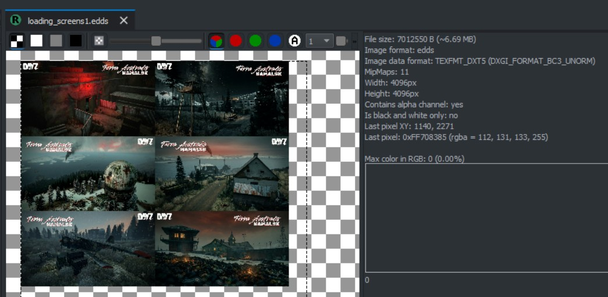
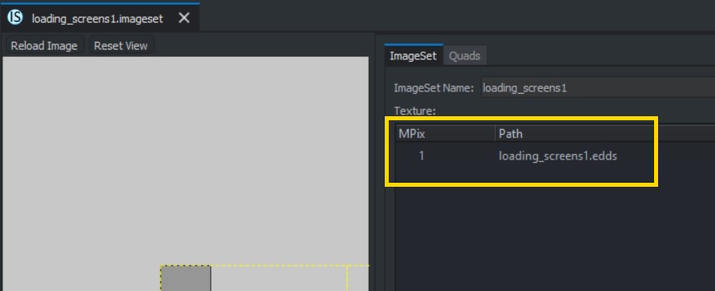
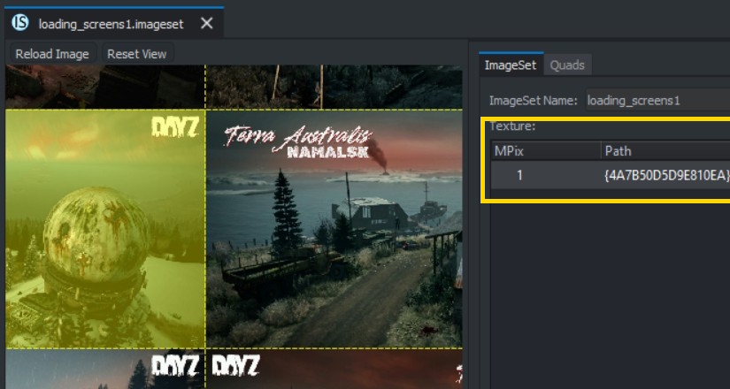

# Basic DayZ Loading-Screens Mod for v1.29 :dizzy:
DayZ loading screens mod that uses imagesets created with either [Strykar86's Imageset Editior](https://github.com/Strykar86/DayZ-Imageset-Editor) or [WoozyMasta's imageset-packer tool](https://github.com/WoozyMasta/imageset-packer). 
This approach avoids the washed-out alpha issues that popped up in v1.29. This is set up to select one of 12 images as a background to the server loading / queue / countdown screens.

## Instructions for packing pngs to the loading_screens1 imageset: :satellite:
1. Install/run DayZ Tools and mount your P drive
2. Download this repo and extract it so you have a P:\LoadingScreensMod\config.cpp with data\ and scripts\ subfolders
3. Download the latest release of [Strykar's Imageset Editor here](https://github.com/Strykar86/DayZ-Imageset-Editor/releases/tag/v1.3)
5. Create 12 loading images as 1920x1080 png files and name them 'loading1.png'...'loading12.png'.
6. Copy these files to _LoadingScreensMod\data_ folder
7. Run Strykar's Imageset Editor
8. Adjust the canvas size (in top menu) to 8192
9. Click 'Import Image(s)' and select all your png files in the _\data_ folder. This should look like this:
>
9. Click 'Export Imageset + EDDS' and save that in the _\data_ folder as 'loading_screens1'.
10. Confirm you have _loading_screens1.EDDS_ and _loading_screens1.imageset_ in your _P:\LoadingScreensMod\data_ folder. If you do, delete all the png files there now.
12. Open Workbench from the DayZ Tools and navigate to the EDDS file you just made in _P:\LoadingScreenMod\data_. They should kinda look like:
> 
11. Now navigate to the imageset file you made in the same folder, which should look like:
> 
12. Double-click the 'Path' highlighted there and browse to the EDD files in the same folder. This should update the path to include a GUID prefix thats required to access the texture correctly (I guess?!), and now look something like:
> 
13. Right-click the imageset you update in the workbench browser and 'Save Selection'.
14. Thats it! You can delete the temporary _\pics_ folder, then compile and test =) :shipit:

## Issues/notes: :finnadie:
- This was way more annoying that expected!
- If you add more or less than 12 images, you will need to edit the TOTAL_IMAGES contant in _scripts/3_game/loadingscreens.c_
- If you want to add more than one imageset (required for more than a couple of 4k images), you will need to add those files to the imageset array in _config.cpp_ as well as tweak _scripts/3_game/loadingscreens.c_ 
- While Stryker's tool makes creating the imageset a breeze, my experiments seem to show that the workbench step (12) adds the GUID prefix to the texture path, whichg did the trick when everything else failed(?!)
- Many thanks to Strykar and the other helpful folk who worked through these issues in the [DayZ Modders UI-UX discord](https://discord.com/channels/452035973786632194/498756118906929162)
- If you wanted to use Woozy's imageset-packer instead, refer to my old (more complicated) [instructions here](README_OLD.md)
- I am probably an idiot and there's an easier way to do this?
