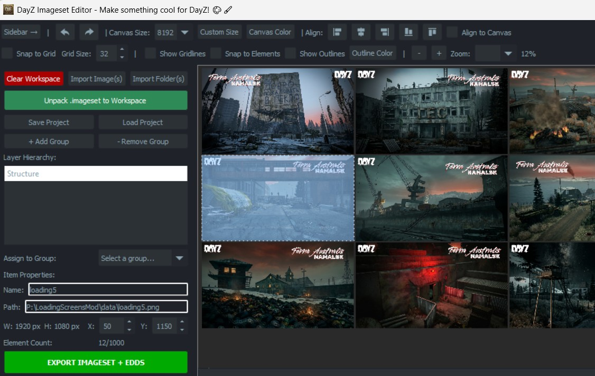

# Basic DayZ Loading-Screens Mod for v1.29 :dizzy:
DayZ loading screens mod that uses imagesets created with either [Strykar86's Imageset Editior](https://github.com/Strykar86/DayZ-Imageset-Editor) or [WoozyMasta's imageset-packer tool](https://github.com/WoozyMasta/imageset-packer). 
This approach avoids the washed-out alpha issues that popped up in v1.29. This is set up to select one of 12 images as a background to the server loading / queue / countdown screens.

## Instructions for creating imageset(s) from PNGs: :satellite:
1. Install/run DayZ Tools and mount your P drive
2. Download this repo and extract it there, so you have a _P:\LoadingScreensMod\config.cpp_ with _\data_ and _\scripts\3_game_ subfolders
3. Download the latest release of [Strykar's Imageset Editor here](https://github.com/Strykar86/DayZ-Imageset-Editor/releases/tag/v1.3)
4. Get your **12** loading screen PNG files of 1920x1080 resolution and name them 'loading1.png' to 'loading12.png'.
5. Copy these files to _LoadingScreensMod\data_ folder
6. Run Strykar's Imageset Editor
7. Adjust the canvas size (in top menu) to 8192
8. Click '**Import Image(s)**' and select your 12 PNG files in the _\data_ folder. This should look something like this:
>
9. Click '**EXPORT IMAGESET + EDDS**', choose the same folder you're working in (_\data_) and name it 'loading_screens1'
11. If you have _loading_screens1.EDDS_ and _loading_screens1.imageset_ in your _\data_ folder, you can delete the PNGs files
12. That's it! Time to pack and test :shipit: I can recommend [Tyson's RaG-PBO-Builder](https://github.com/Tyson89/RaG-PBO-Builder) as a free and regularly updated packing tool.

## Issues/notes: :finnadie:
- This was way more annoying than expected!
- If you add more or less than 12 images, you will need to edit the TOTAL_IMAGES contant in _scripts/3_game/loadingscreens.c_
- If you want to add more than one imageset (required for than a couple of 4k images), you will need to add those files to the imageset array in _config.cpp_ as well as tweak _scripts/3_game/loadingscreens.c_
- Many thanks to Strykar and the other helpful folk who worked through these issues in the [DayZ Modders UI-UX discord](https://discord.com/channels/452035973786632194/498756118906929162)
- If you wanted to use Woozy's imageset-packer OR see how to do a multi-imageset version, refer to my old (more complicated) [instructions here](README_OLD.md)
- This uses the vanilla game layout files, which means the usual loading progress bar/queue position/count down widgets appear on the bottom of the screen. It's easy to hide those too if you're keen but you want to check what they're called in each screen in [the vanilla source](https://github.com/BohemiaInteractive/DayZ-Script-Diff/blob/c75a7824add7619616f2516402ff0f7018299a8a/scripts/3_game/dayzgame.c#L688)
- If you were going to add a logo or text to your backgrounds, I would add them to the top half because those vanilla layouts mask the bottom third of the screen
